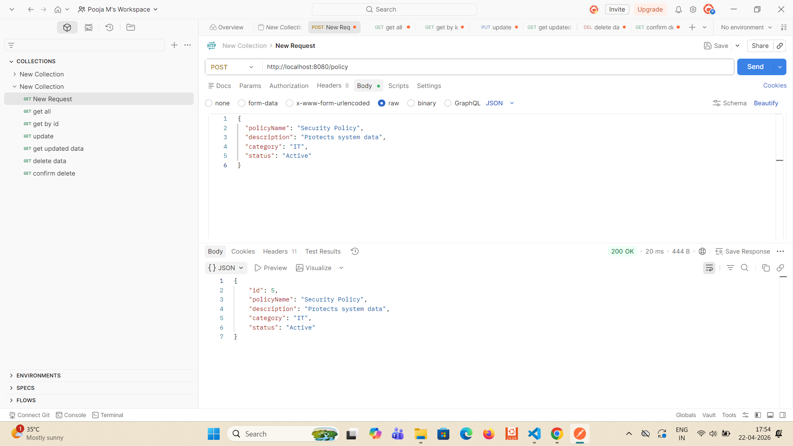
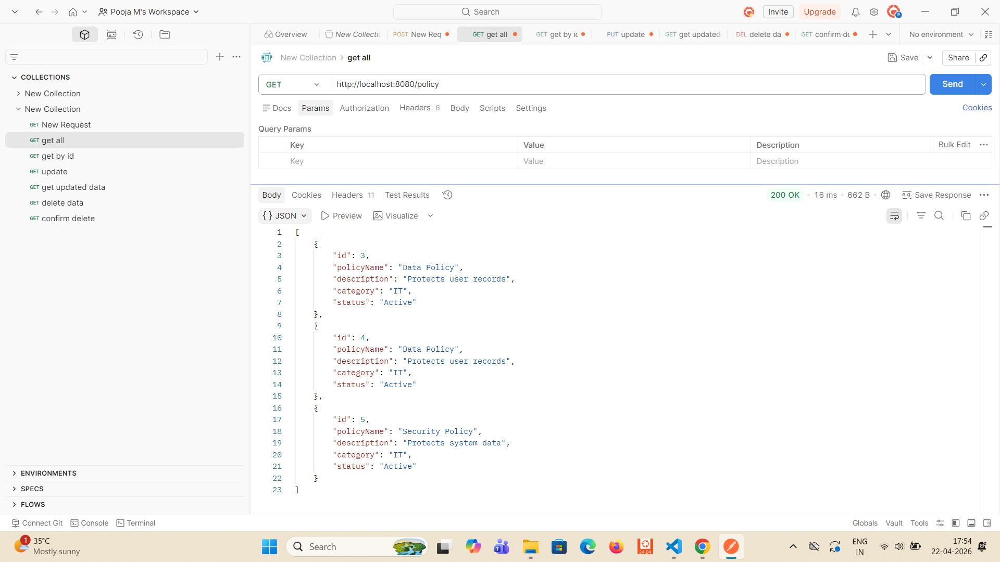
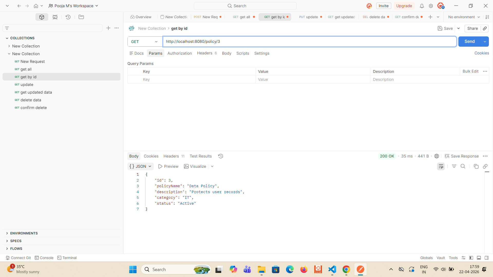
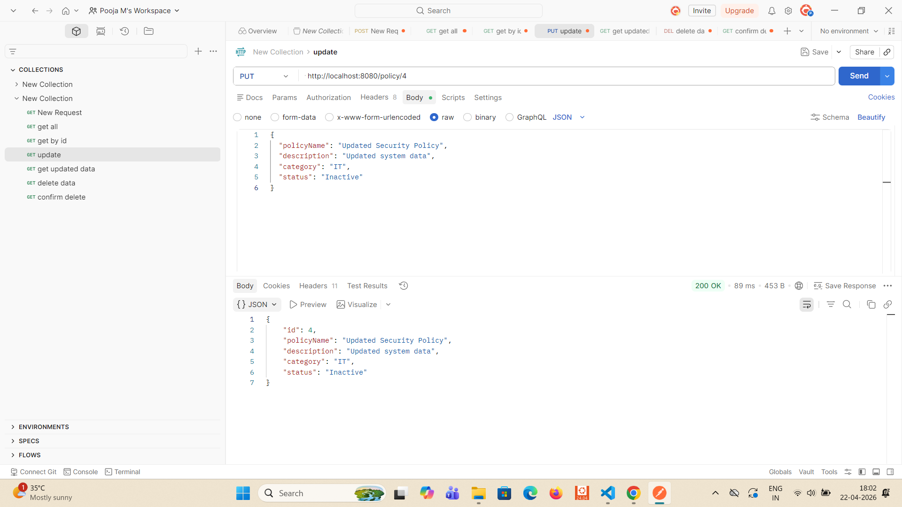
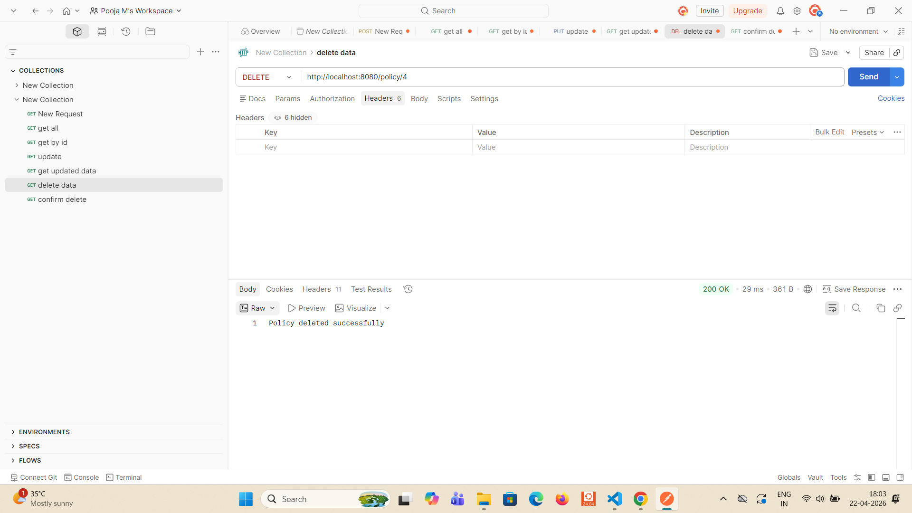
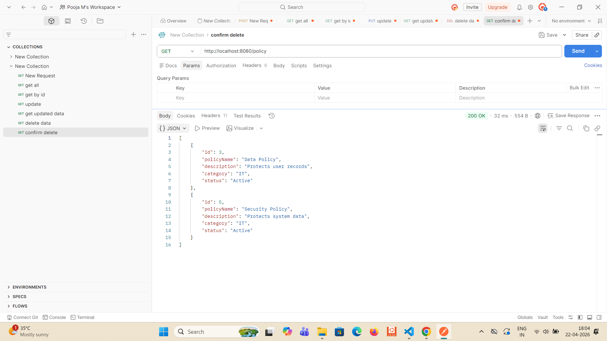
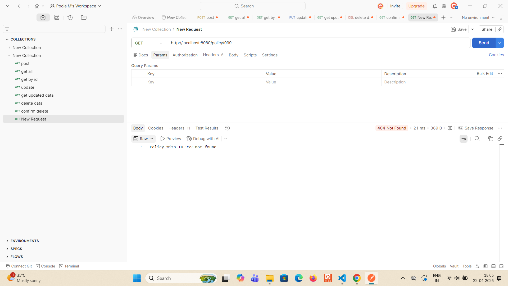
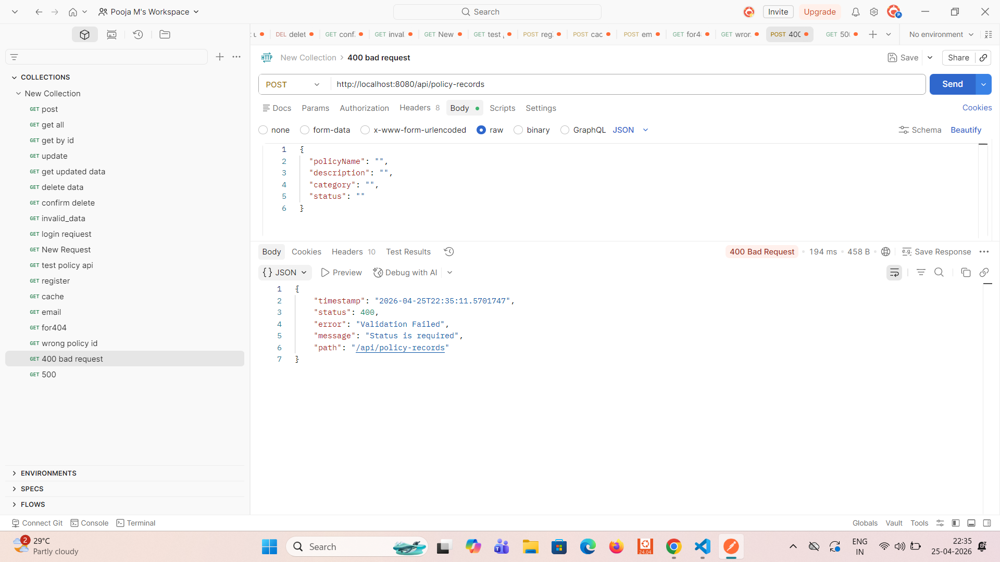
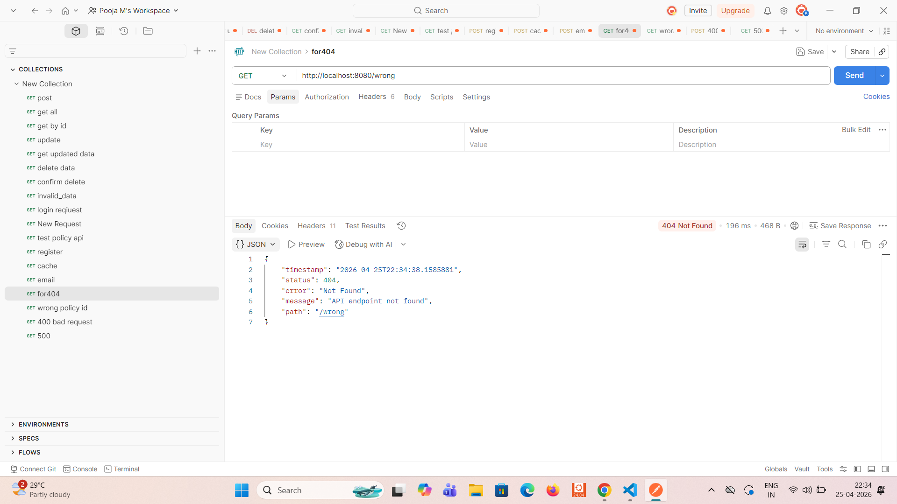
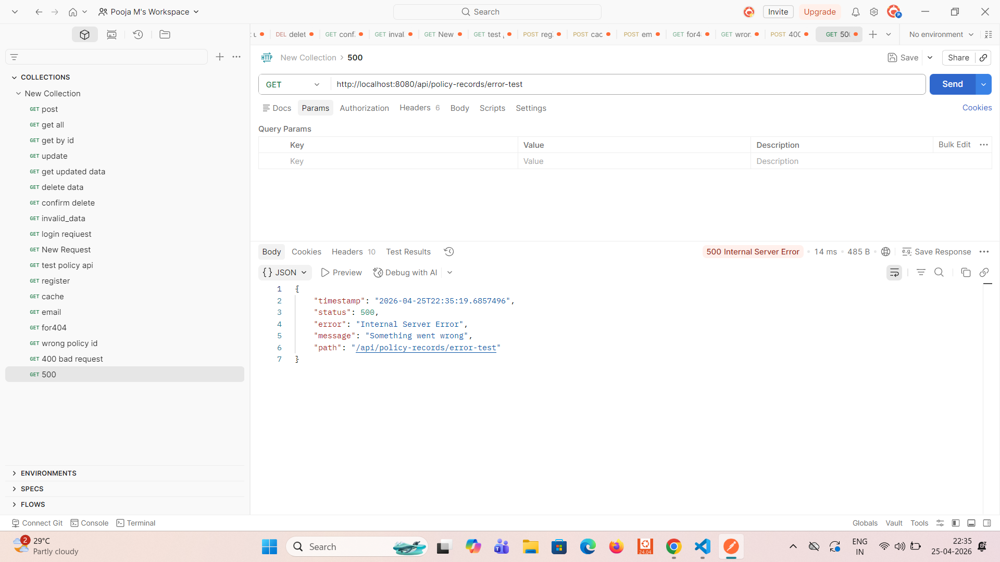

# Day 1 &day 2 Progress - Java Developer 1

## 👩‍💻 Work Done Today

Today I worked on setting up the backend for the Regulatory Policy Alignment Tool using Spring Boot. I implemented the core structure and developed REST APIs for managing policy records.

---

## ⚙️ Tasks Completed

### 1. Project Setup
- Created a Spring Boot project using Maven
- Configured application properties for PostgreSQL database connection
- Verified project is running successfully on port 8080

---

### 2. Folder Structure Setup
Created proper layered architecture:

- controller → for handling API requests
- service → for business logic
- repository → for database operations
- entity → for mapping database tables
- config → for security configuration

---

### 3. Entity Layer
- Created `PolicyRecord.java`
- Mapped fields:
  - id
  - policyName
  - description
  - category
  - status
- Used JPA annotations for table creation

---

### 4. Repository Layer
- Created `PolicyRecordRepository.java`
- Extended JpaRepository
- Enabled basic database operations:
  - save()
  - findAll()
  - findById()
  - deleteById()

---

### 5. Service Layer
- Created `PolicyRecordService.java`
- Implemented business logic for:
  - Create policy
  - Retrieve all policies
  - Retrieve policy by ID
  - Update policy
  - Delete policy

---

### 6. Controller Layer
- Created `PolicyRecordController.java`
- Implemented REST APIs:

  - POST `/policy` → Create new policy
  - GET `/policy` → Get all policies
  - GET `/policy/{id}` → Get policy by ID
  - PUT `/policy/{id}` → Update policy
  - DELETE `/policy/{id}` → Delete policy

---

### 7. Security Configuration
- Created `SecurityConfig.java`
- Disabled CSRF for testing
- Allowed all API requests using `permitAll()`

---

### 8. Database Integration
- Connected Spring Boot with PostgreSQL
- Verified that table `policy_record` is created automatically
- Confirmed data is stored in database

---

### 9. API Testing
- Tested all APIs using Postman

Verified:
- POST request successfully saves data
- GET request retrieves all data
- GET by ID returns specific record
- PUT request updates data correctly
- DELETE request removes data

---

## 🧪 Sample API Tested

### POST /policy
```json
{
  "policyName": "Security Policy",
  "description": "Protects system data",
  "category": "IT",
  "status": "Active"
}
```

---

## 🚀 Current Status

✔ Spring Boot backend setup completed  
✔ PostgreSQL database connected successfully  
✔ Layered architecture implemented  
✔ CRUD APIs developed  
✔ All APIs tested using Postman  

---

## 📅 Next Plan

- Implement JWT Authentication
- Add validation annotations (@NotNull, @Size)
- Add exception handling
- Improve security configuration

## Day 3 Progress - Java Developer 1

### Work Done Today

Today I worked on improving the backend logic of the Regulatory Policy Alignment Tool. I completed the service layer properly and added exception handling for API errors.

### Tasks Completed

#### 1. Service Layer Improvement
- Updated `PolicyRecordService.java`
- Implemented proper business logic for:
  - Create policy
  - Get all policies
  - Get policy by ID
  - Update policy
  - Delete policy

#### 2. Full Update Logic
- Improved update API logic
- Updated all fields:
  - policyName
  - description
  - category
  - status

#### 3. Exception Handling
- Created `GlobalExceptionHandler.java`
- Added handling for:
  - Validation errors
  - Runtime exceptions
  - General exceptions

#### 4. API Testing
- Tested APIs in Postman:
  - POST
  - GET all
  - GET by ID
  - PUT
  - DELETE

### Status

✅ Service layer completed  
✅ Update logic improved  
✅ Exception handling added  
✅ CRUD APIs tested successfully  

### Next Plan

- Add validation annotations
- Improve controller responses
- Continue remaining backend tasks step by step


# Regulatory Policy Alignment

## Day 4 Progress – Java Developer 1

### 🔹 Work Done Today
Implemented REST Controller and tested all CRUD APIs using Postman. Verified that all endpoints are working correctly.

---

## 🔹 Tasks Completed

### 1. REST Controller Implementation
- Created `PolicyRecordController.java`
- Added following endpoints:
  - POST → Create new policy
  - GET → Fetch all policies
  - GET by ID → Fetch single policy
  - PUT → Update policy
  - DELETE → Delete policy

---

### 2. API Testing (Postman)

All APIs tested successfully:

-  Create Policy (POST)
-  Get All Policies (GET)
-  Get Policy by ID (GET)
-  Update Policy (PUT)
-  Delete Policy (DELETE)
- Invalid ID Handling (Error case tested)

---

## 🔹 Screenshots

###  Create Policy


###  Get All Policies


###  Get Policy By ID


###  Update Policy


###  Delete Policy


###  Confirm Delete


###  Invalid ID Handling


---

## 🔹 Status
✔ Controller implemented successfully  
✔ All CRUD APIs working  
✔ Error handling verified  

---

## 🔹 Next Plan (Day 5)
- Implement JWT Authentication
- Add validation annotations (@NotNull, @Size)
- Improve security configuration

## Day 5 - JWT Authentication

### Description
Implemented authentication and security using JWT (JSON Web Token).

### Work Done
- Created User entity and UserRepository
- Implemented AuthController with:
  - Register API (/auth/register)
  - Login API (/auth/login)
  - Refresh API (/auth/refresh)
- Generated JWT token using JwtUtil
- Implemented JwtAuthFilter to validate token for each request
- Configured Spring Security using SecurityConfig
- Secured policy APIs using JWT token

### APIs Tested
1. Register API  
   POST /auth/register  
   Stores user in database  

2. Login API  
   POST /auth/login  
   Validates user and returns JWT token  

3. Refresh API  
   POST /auth/refresh  
   Generates new token from old token  

4. Protected API  
   GET /policy  
   Requires Authorization header  

### Learning Outcome
- Understood JWT authentication flow
- Learned how to secure APIs using Spring Security
- Implemented request filtering using JwtAuthFilter
 
 ## Day 6 - Caching and RBAC

### Work Done
- Implemented JWT-based authentication
- Protected APIs using Authorization header
- Enabled caching using @EnableCaching
- Used @Cacheable on GET APIs
- Used @CacheEvict on CREATE, UPDATE, DELETE APIs
- Configured simple in-memory cache
- Tested all APIs using Postman

### APIs Tested
- POST /auth/register
- POST /auth/login
- GET /policy
- PUT /policy/{id}
- DELETE /policy/{id}

### Learning Outcome
Learned how caching improves performance and how RBAC secures APIs using JWT tokens.

## Day 7 - Email Notification & Scheduler

### Description

Implemented email notification system using JavaMailSender and Thymeleaf templates. Added scheduled tasks for daily reminders and deadline alerts using @Scheduled annotation.

### Work Done

* Added JavaMailSender dependency for email sending
* Created EmailService to handle email logic
* Used Thymeleaf template (reminder-email.html) for dynamic email content
* Created EmailController API to trigger email notifications
* Implemented ReminderScheduler with @Scheduled annotation

  * Daily reminder (9 AM)
  * Deadline alert (6 PM)
* Configured application.yaml for mail properties
* Tested email API in demo mode

### API Tested

POST /email/send?toEmail=[example@gmail.com](mailto:example@gmail.com)

### Output

* Demo email notification generated successfully
* Console logs show scheduler execution

### Learning Outcome

* Learned how to implement email notifications using Spring Boot
* Understood Thymeleaf template integration for dynamic email content
* Learned scheduling using @Scheduled annotation
* Understood SMTP configuration and security (App Password concept)

# Day 8 – Exception Handling and Unit Testing

## Task
@ControllerAdvice – 404/400/500 consistent JSON response.  
10 JUnit 5 unit tests for Service with Mockito.

---

## Work Done
- Implemented global exception handling using `@RestControllerAdvice`
- Added consistent JSON response for 400, 404 and 500 errors
- Added 10 JUnit 5 test cases for `PolicyRecordService`
- Used Mockito to mock repository layer
- All tests passed successfully

---

## Screenshots

### 400 – Bad Request


### 404 – Not Found


### 500 – Internal Server Error



---

## Status
Day 8 Completed ✅